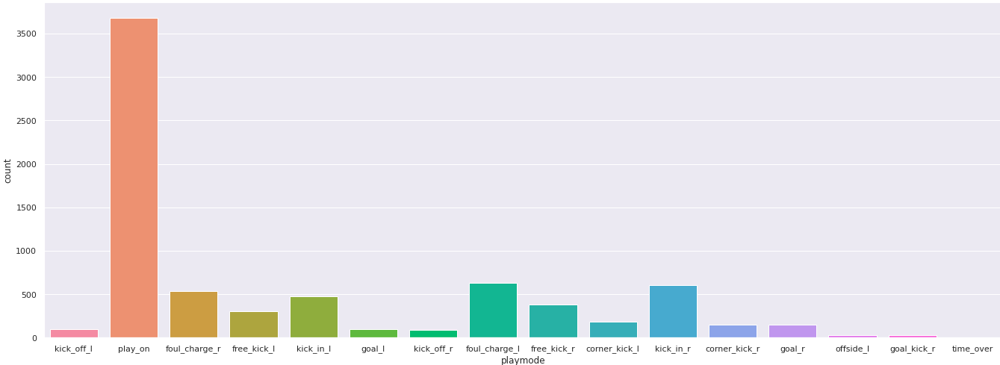

# Descriptive-analysis-robocin-match

 It is a project used for Robocin Selective. This is an analysis of an intelligent agent's soccer match. 
 

 I received the logs from a match through in .rcg, that I need to convert in .csv. From that, I made observations about the attributes of the match by graphs and I created an algorithm to calculate the ball possession. 

